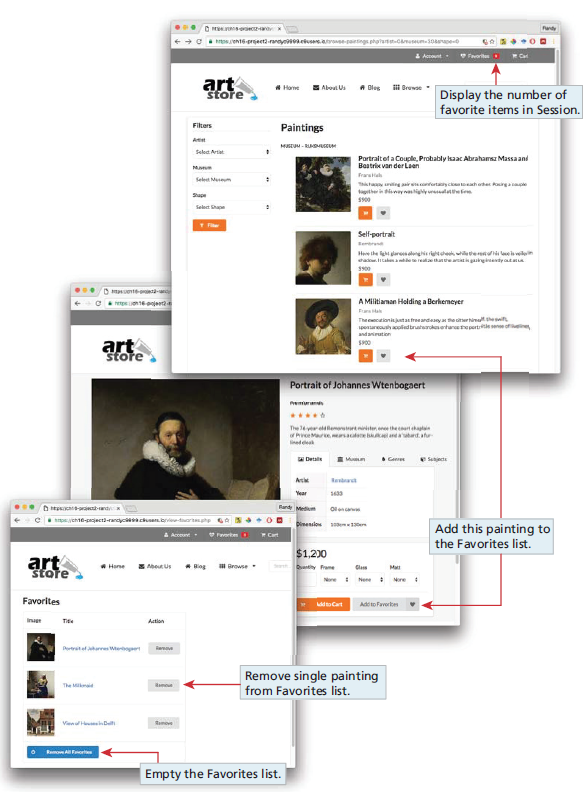

# In-class Cookie activity 007
## IMPORTANT - Go to `People` on Canvas and join a group (self-signup), if you are working in one.
## Forking this repo (BLAH BLAH BLAH ... the same verbiage as earlier)
To work on this project, you will need to create a personal copy of the repository. This is done by forking it. Follow these steps:
### 1. Fork repository
- Click the “Fork” button located in the upper right corner of the repository page.
- This will create a copy of the repository under your GitHub account. (only one in the project will do this!)
### 2. Clone Your Fork
- On your GitHub account, navigate to your forked repository.
- Clone the forked repository to your local machine.
### 3. Adding Collaborators
- Add your project members in the same way as you would for a normal repository.
- Go to `Settings`, `Collaborators` to add members to this repo.
### 4. New branch
- ***VERY IMPORTANT*** -> Create a new branch before you make any changes to the forked repo!!
- Once the branch is created, make the changes as per project requirements.
- You can make as many commits and as many pushes as needed to that branch that was newly created.
- To be consistent, use the same styling for commit messages that was given in the Project I.
    - [Prefix] – [Short description of the change]
      The following are the only possible options for [Prefix]:
    - FEAT - For new features or major additions to the project.
        - Example: `FEAT - Added contact form to the Contact page`
    - FIX - For bug fixes, corrections, or revisions to the code.
        - Example: `FIX - Corrected navigation bar alignment on mobile devices`
    - STYLE - For stylistic changes such as formatting, CSS modifications, or minor visual updates.
        - Example: `STYLE - Updated color scheme for better contrast`
    - DOCS - For changes or additions to the documentation, including README files and comments in the code.
        - Example: `DOCS - Added project description and setup instructions to README`
    - SECURITY - For changes related to improving the security of the website.
        - Example: `SECURITY - Implemented input validation for contact form`
    - REFACTOR - For code refactoring that doesn’t change functionality but improves code quality or organization.
        - Example: `REFACTOR - Organized CSS files and cleaned up redundant styles`
    - TEST - For adding tests or making changes to the testing suite.
        - Example: `TEST - Added validation tests for contact form input`

### 5. Submitting your work
Once, you are sure that all the work is completed, go through the following steps for submission.
- Go to your forked repository on GitHub.
- Click on the “Pull requests” tab and then the “New pull request” button.
- Select the branch you pushed your changes to.
- Click “Create pull request” and provide a title and description for your changes.
- Submit the pull request.
- If you have made a pull request on error or have made further changes to the branch, you can always close the pull request that was made and make a new pull request.
- The closest pull request to the due date will be reviewed.

### 6. Grading and Feedback
- After the submission deadline, your pull request will be reviewed.
- Feedback and grades will be provided based on the changes made and the quality of the work.

Not sure, how to create a pull request, check this [link](https://docs.github.com/en/pull-requests/collaborating-with-pull-requests/proposing-changes-to-your-work-with-pull-requests/creating-a-pull-request-from-a-fork).

# Activity description
Demonstrate your ability to create a data-driven PHP page and manage the state of the website using Cookies.
You should have PHP installed on your machine at this point, if not use ChatGPT to get instructions on how to install PHP on your machine.

Once installed navigate to this cloned repo on the terminal and type in the following commands to check the successful installation and start the PHP server:

* `php -v`
* `php -S localhost:8000`

Open a browser and access the http://localhost:8000/browse-paintings.php webpage. Change the port number if you are using a different one.

1. Begin by finding the project folder you have created for the Art Store. Session
   integration requires adding the session_start() function call to all pages that
   will use session data. If your paintings are not being displayed properly, then fix the php files.
2. Both `browse-painting.php` and `single-painting.php` contain Add to Favorites
   links styled as buttons. Modify these links so that clicking on them will take
   the user to `addToFavorites.php`. These links need to provide indicate which
   painting to add to the favorites list via a query string. To make our view
   favorites page easier to implement, include the `PaintingID`, `ImageFileName`,
   and `Title` fields in the query string.

3. Create a new file named `addToFavorites.php` that will handle a GET request
   to add a painting to the favorites list. This file will contain no markup: it will
   check for the existence of the relevant query string fields, and then add the
   painting information to session state.
4. The favorites list will be represented as an array of arrays. Each favorite item
   will be an array that contains the `PaintingID`, `ImageFileName`, and `Title`
   fields for the painting. You will need to retrieve the favorites array from
   session state (or create it as a blank array if it doesn’t exist), and then add the
   array for the new favorite item to the favorites array. You must then store the
   modified favorites array back in session state. After this, redirect to `viewfavorites.
   php` using the header() function.
5. Modify the `view-favorites.php` page so that it displays the content of the favorites
   list in a table. For each painting in the favorites list, display a small version of the
   painting (from the images/art/works/small-square folder) and its title. Make the
   title a link to `single-painting.php` with the appropriate querystring.
6. Change the button links that will remove each painting from the favorites list as
   well as the button link to empty all the favorites from the list. These will be links
   to `remove-favorites.php`; for the remove single painting links, the PaintingID of
   the painting to remove will be provided as a query string parameter.
7. Create a new file named, `remove-favorites.php` that will handle a GET request to
   remove a single painting to the favorites list (or remove all paintings). This file
   will contain no markup: it will check for the existence of the relevant query string
   fields and then remove the specified paintings from the favorites array in session
   state. After removing, redirect back to the `view-favorites.php` page.
8. Modify the `art-header.inc.php` file to display a count of the items in the favorites
   list. Use the class “ui red mini label.”

## Tips and Suggestions
* Start small: Break this problem down into smaller steps. First verify the globals are being read properly in the PHP file.
* You may decide to move your code into classes within your module after you
  finished your code, or you may decide to work with classes and modules right
  from the start.
* **DON’T USE ABSOLUTE PATHS**. Use only relative paths in your project files. This practice is particularly important when multiple people are working on the same project, as it ensures that links and references work correctly across different environments and systems.
* Iterate and Test: Continuously test your website after making necessary changes.
* Issues: Use the GitHub to create Issues and track the status of the issues using Milestones.
* Focus on Details: Pay attention to small details like spacing, hover effects, to create a polished final product.

